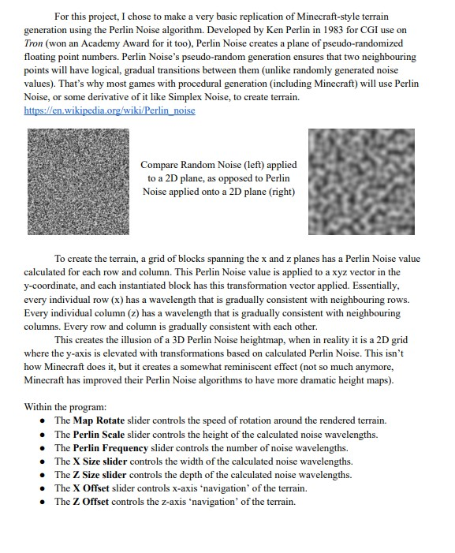

# Perlin Noise Terrain
Developed as an end-of-course project for my Computer Graphics course. 

A small program showing the usage of the Perlin Noise algorithm, applied to Unity Cube objects, which allow the user to generate and manipulate a Minecraft-style terrain with mountains, valleys, and water bodies. 

The following documentation elaborates on Perlin Noise, as well as explains some basic program functions. 

