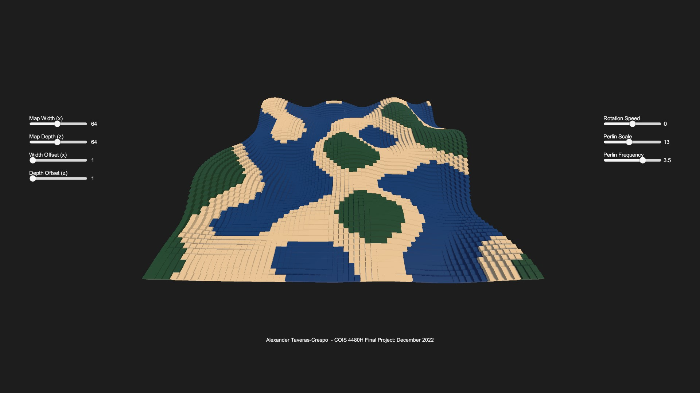

# Perlin Noise Terrain
A fully functional WebGL build of the project can be accessed at https://ataverascrespo.itch.io/minecraft-perlin-noise. 

Developed as an end-of-course project for my Computer Graphics course. 

A small program showing the usage of the Perlin Noise algorithm, applied to Unity Cube objects, which allow the user to generate and manipulate a Minecraft-style terrain with mountains, valleys, and water bodies. 

For this project, I chose to make a very basic replication of Minecraft-style terrain generation using the Perlin Noise algorithm. Developed by Ken Perlin in 1983 for CGI use on Tron (won an Academy Award for it too), Perlin Noise creates a plane of pseudo-randomized floating point numbers. Perlin Noise’s pseudo-random generation ensures that two neighbouring points will have logical, gradual transitions between them (unlike randomly generated noise values). That’s why most games with procedural generation (including Minecraft) will use Perlin Noise, or some derivative of it like Simplex Noise, to create terrain. 

To create the terrain, a grid of blocks spanning the x and z planes has a Perlin Noise value calculated for each row and column. This Perlin Noise value is applied to a xyz vector in the y-coordinate, and each instantiated block has this transformation vector applied. Essentially, every individual row (x) has a wavelength that is gradually consistent with neighbouring rows. Every individual column (z) has a wavelength that is gradually consistent with neighbouring columns. Every row and column is gradually consistent with each other.  This creates the illusion of a 3D Perlin Noise heightmap, when in reality it is a 2D grid where the y-axis is elevated with transformations based on calculated Perlin Noise. These wavelengths can be better observed when sliding either Map Width or Map Depth to their lowest value (5). What's missing in my implementation is that Minecraft applies several octaves of noise onto eachother for dramatic height maps. Additionally, my implementation features a grid of blocks with a y value (height) of 1 meaning hills/mountains are empty underneath often leading to 'holes' in the terrain, whereas Minecraft applies noise to their min/max height y values of -64/+320 creating 'filled-in' terrain. 
/
Within the program:
* The Rotate Angle slider controls the angle of rotation around the terrain.
* The Perlin Scale slider controls the height of the calculated noise wavelengths.
* The Perlin Frequency slider controls the number of noise wavelengths.
* The Map Width slider controls the width of the calculated noise wavelengths.
* The Map Depth slider controls the depth of the calculated noise wavelengths.
* The Width Offset slider controls x-axis ‘navigation’ of the terrain. 
* The Depth Offset slider controls the z-axis ‘navigation’ of the terrain. 
* The Light Position slider controls the angle of rotation of the lighting on the x-axis.

There is also background music, a song titled Aria Math produced by C418 exclusively for Minecraft.
